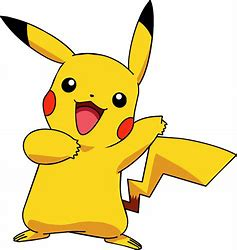
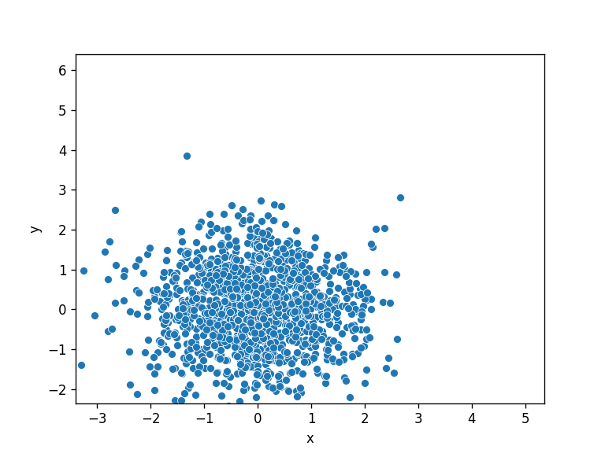

# An Example Application of DDPM

---

## Table of Contents

1. [Introduction](#introduction)  
2. [Neural Networks](#neural-networks)  
3. [Presentation of the Model](#presentation-of-the-model)  
 3.1 [Justification of the Model](#justification-of-the-model)  
4. [The Experiment](#the-experiment)

---

## Introduction

DDPM (Denoising Diffusion Probabilistic Models) are one of the tools within the family of generative methods. A generative method aims to produce new data that closely resemble real data—for example, images of cats that are, to the human eye, indistinguishable from real photographs taken “in the real world.”

The underlying idea of many generative methods is that data of the same type can be modeled as IID random variables with an unknown distribution; to generate new and plausible data, it is sufficient to determine this unknown distribution and sample from it. DDPMs follow this logic. In particular, they consist of two phases:

1. **Diffusion Process:** In this phase, a real data point is gradually distorted by adding Gaussian noise step by step until the distorted data approximately follow a Gaussian distribution.
2. **Reverse Process:** In this phase, the initial data point is sampled from an isotropic Gaussian distribution, and the steps of the previous process are retraced in reverse to recover the original data.

Section 3 provides the details of this process. In this work, an example is presented that demonstrates the phases of the process through an image that is first distorted and then reconstructed by sampling from an isotropic Gaussian distribution.

---

## Neural Networks

A neural network is a function that can be modeled using a graph. In particular, we consider feedforward neural networks: the graph is acyclic and the nodes are organized into consecutive layers. In this context, the nodes are called units and the edges are weighted. Each unit receives a real number as input—the weighted sum (according to the weights of the respective edges) of the outputs from the nodes in the preceding layer. An activation function is then applied to this input, and its output is distributed to the units in the subsequent layer based on the corresponding weights.

Commonly used activation functions include the sigmoid function  
σ(x) = 1 / (1 + exp(−x)),  
the ReLU function  
ReLU(x) = max(0, x),  
and the hyperbolic tangent. These functions ensure the neural network has good expressiveness, as there are theorems stating that neural networks using these activation functions are dense in C₀(ℝᵈ, ℝᵐ, ||·||∞).

Neural networks can be trained, meaning their performance can be improved by providing data. In fact, a neural network is built with a specific objective (for example, to calculate the parameters of a distribution). A loss function is associated with this objective to measure, in an appropriate sense, how much the network’s performance deviates from the desired outcome. The network’s performance can be improved using a gradient descent algorithm to find the weight values that minimize the loss function.

An interesting property of neural networks is that, to compute the gradient of the loss function, it is sufficient to calculate the partial derivatives with respect to the weights of the output layer. In fact, by applying the chain rule of derivatives, one can compute the partial derivatives with respect to the other weights through simple algebraic manipulations (additions and multiplications) of the already computed derivatives. This approach, known as back-propagation, computes the gradient only for the final layer and then traverses the network backward to obtain the complete gradient without explicitly computing all derivatives.

---

## Presentation of the Model

Let **x₀** be the random variable representing a data point, and let **x₁, …, xₜ** (with t = 1, …, T) be latent variables of the same dimension as **x₀**. These variables model two discrete-time stochastic processes: the diffusion process from **x₀** to **xₜ** and the reverse process from **xₜ** back to **x₀**. In DDPM, these processes are modeled as Markov chains. In particular, let **p₍θ₎(x₀, …, xₜ)** denote the joint distribution of the variables, and **q(x₁, …, xₜ | x₀)** denote the posterior distribution that approximates **p₍θ₎(x₁, …, xₜ | x₀)**. By the Markov property, we have:

  p₍θ₎(x₀, …, xₜ) = p(xₜ) ∏ₜ₌₁ᵀ p₍θ₎(xₜ₋₁ | xₜ)  
  q(x₁, …, xₜ | x₀) = ∏ₜ₌₁ᵀ q(xₜ | xₜ₋₁)             (1)

As mentioned in the introduction, we desire that at the end of the diffusion process the latent variable follows an isotropic Gaussian distribution. Therefore, we set p(xₜ) = N(0, I). Furthermore, the model is defined by setting  
p₍θ₎(xₜ₋₁ | xₜ) = N(μ₍θ₎(xₜ, t), Σ₍θ₎(xₜ, t))  
and  
q(xₜ | xₜ₋₁) = N(xₜ₋₁ √(1 − βₜ), βₜ I),  
where β₁, …, βₜ are hyperparameters of the model.

In this context, the goal is to train a neural network to reconstruct the data from purely Gaussian noise. The parameters of the neural network are “captured” by the parameter θ. To find the optimal value of θ, we seek the maximum likelihood estimator  
θ̂ = argmin₍θ₎ E[− log p₍θ₎(x₀)].  
Through some straightforward calculations, one obtains:

  E[− log p₍θ₎(x₀)] ≤ E₍q₎[− log (p₍θ₎(x₀, …, xₜ) / q)]  
       = E₍q₎[− log p(xₜ) − ∑ₜ₌₁ᵀ log (p₍θ₎(xₜ₋₁ | xₜ) / q(xₜ | xₜ₋₁))]  
       = E₍q₎[DKL(q(xₜ | x₀) || p(xₜ)) + ∑ₜ₌₂ᵀ DKL(q(xₜ₋₁ | xₜ, x₀) || p₍θ₎(xₜ₋₁ | xₜ)) − log p₍θ₎(x₀ | x₁)]  
       = L

Here, L is called the *variational upper bound (VUB)*, and to make the problem tractable we minimize the VUB rather than the negative log-likelihood directly.

Let  
  αₜ = 1 − βₜ  and  ᾱₜ = ∏₍s=1₎ᵗ αₛ.  
It can be shown that:

  q(xₜ | x₀) = N(x₀ √(ᾱₜ), (1 − ᾱₜ) I)      (2)

  q(xₜ₋₁ | xₜ, x₀) = N(ṽₜ, β̃ₜ I)         (3)

where

  ṽₜ = (βₜ √(ᾱₜ) / (1 − ᾱₜ)) x₀ + (√(αₜ (1 − ᾱ₍ₜ₋₁₎) / (1 − ᾱₜ))) xₜ  
  β̃ₜ = [(1 − ᾱ₍ₜ₋₁₎) / (1 − ᾱₜ)] βₜ         (4)

Thanks to these expressions and the fact that the KL divergence between two Gaussian distributions has a closed-form expression in terms of mean and variance, it is possible to explicitly compute the VUB. In fact, for d-dimensional Gaussian distributions p(x) = N(μ₁, Σ₁) and q(x) = N(μ₂, Σ₂), one obtains:

  DKL(p || q) = ½ [log(|Σ₂|/|Σ₁|) − d + tr(Σ₂⁻¹Σ₁) + (μ₂ − μ₁)ᵀ Σ₂⁻¹ (μ₂ − μ₁)]   (5)

In the experiment, it is assumed that q(xₜ₋₁ | xₜ, x₀) and p₍θ₎(xₜ₋₁ | xₜ) have the same (diagonal) covariance matrix. As a result,  
  DKL(q(xₜ₋₁ | xₜ, x₀) || p₍θ₎(xₜ₋₁ | xₜ)) ∝ ||ṽₜ − μ₍θ₎(t)||²₂ + constant,  
which justifies using the mean squared error between ṽₜ and μ₍θ₎(t) as the loss function.

---

## Justification of the Model

This section provides a brief justification for the model, specifically why the distributions defined above should characterize a diffusion process and its reverse.

The diffusion process can be modeled by the following equation:

  xₜ = (1 − τ) xₜ₋₁ + √(2τ) Z, with Z ∼ N(0, I) and τ << 1   (6)

In other words, at each step the data is multiplied by a number slightly less than one, and Gaussian noise is added. Note that this is the Euler–Maruyama discretization of the continuous stochastic process:

  dXₜ = −Xₜ dt + √2 dBₜ       (7)

It can be shown that

  Xₜ is distributed as e^(−t) X₀ + √(1 − e^(−2t)) Z, with Z ∼ N(0, I)  (8)

Thus, by setting ᾱₜ = e^(−2t), we have  
  p(xₜ | x₀) ∼ N(x₀ √(ᾱₜ), (1 − ᾱₜ) I).

Similarly, the other distributions can be justified.

---

## The Experiment

The experiment demonstrates how a diffusion process works using a Python program. The following description refers to the code provided in the full document (which is not included here).

The process begins with the image of a well-known cartoon character. This image is then simplified—that is, reduced to a black-and-blue version—using the function *scatter_pixels* (see the full document for details).

Next, the model’s hyperparameters are defined:

- **beta_start** corresponds to β₀.
- **beta_end** corresponds to βₜ.
- **num_diffusion_timesteps** is the number of states in the two stochastic processes.
- **betas** is an array containing the chosen values of βₜ.
- **alphas** is an array containing the values of αₜ.
- **list_bar_alphas** is a list containing the values of ᾱₜ, computed as explained in the previous section.
- **training_steps_per_epoch** is the number of iterations used to train the neural network per epoch (note: when training a neural network, the dataset is provided to the model several times in a loop; an epoch corresponds to one complete pass through the dataset).
- **pbar = tqdm(range(n))** sets the number of epochs to n.

At this point, a neural network is created and trained to reconstruct the original image from purely Gaussian noise. In this experiment, the PyTorch library is used to easily create neural networks. These networks are defined as Python classes whose attributes include the activation functions and layers, and which implement a forward method to apply the network to a given input. The “Denoising” neural network (detailed in the full document) takes as input a distorted data point and a time t (indicating the current step in the process) and returns the mean of the distribution p₍θ₎(xₜ₋₁ | xₜ).

The training process includes:
- **Specifying the Loss Function:** Using `criterion = nn.MSELoss()`, which is the mean squared error as mentioned in Section 3.
- **Defining the Neural Network:** For example,  
  `denoising_model = Denoising(DATA_SIZE, num_diffusion_timesteps).to(device)`  
  identifies the network as *denoising_model*.
- **Gradient Descent:** Using an optimizer such as `optimizer = optim.AdamW(denoising_model.parameters())`.

Within the training loop, the following steps are executed:
- Reset the loss to zero.
- Randomly select time steps for each training iteration.
- Sample data from the distribution q(xₜ | x₀) using the function *q_sample*.
- Compute the posterior using the function *posterior_q*, which calculates ṽₜ and β̃ₜ.
- Reset gradients, perform a forward pass through the neural network, and compute the mean squared error between μ₍θ₎(t) and ṽₜ.
- Back-propagate the loss and update the network parameters.

After training, a data point is sampled from an isotropic Gaussian distribution and then gradually reconstructed by applying the function *denoise_with_mu*. This function applies the neural network to the current data point xₜ, computes the distribution p₍θ₎(xₜ₋₁ | xₜ), and returns a less distorted data point xₜ₋₁ by sampling from that distribution.

At each iteration, a plot of the data is generated and saved to build a GIF that visually represents the reconstruction process over time.

  

  

